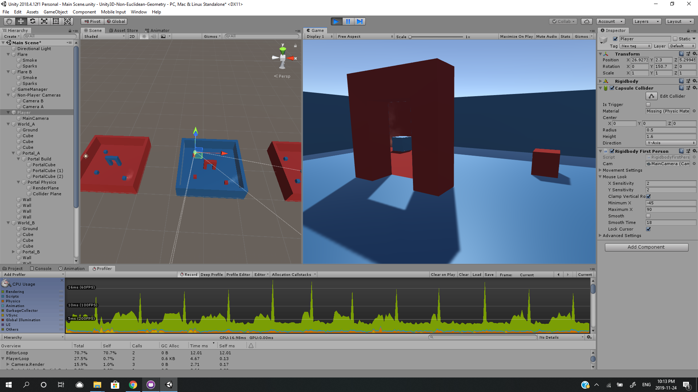

# Unity3D-Non-Euclidean-Geometry
My implementation of Non-Euclidean geometry in Unity3D. Check out the README! 
I will be releasing a tutorial on [my website](https://billbai0102.github.io "My website :)") sometime soon.

